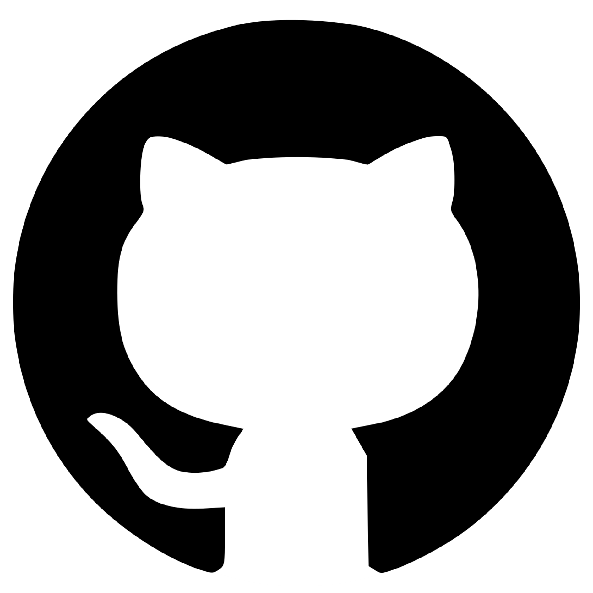

```{r setup, include=FALSE}
knitr::opts_chunk$set(echo = TRUE, eval = FALSE)
```

<!-- ==========================================================
     ESTILOS: fondo negro, texto blanco y código con tema Drácula
     ========================================================== -->
<style>
:root{
  --drac-bg:      #282a36;
  --drac-fg:      #f8f8f2;
  --drac-comment: #6272a4;
  --drac-cyan:    #8be9fd;
  --drac-green:   #50fa7b;
  --drac-orange:  #ffb86c;
  --drac-pink:    #ff79c6;
  --drac-purple:  #bd93f9;
  --drac-red:     #ff5555;
  --drac-yellow:  #f1fa8c;
}

/* ---------- Página ---------- */
body{
  background-color: #1a1b21 !important;
  color: #f2f2f2 !important;
  font-size: 17px;
  line-height: 1.65;
}
h1, h2, h3, h4, h5, h6{ color: #ffffff !important; font-weight: 600; }
h1.title{ color:#ffffff !important; font-weight:300; letter-spacing:1px; }
h1{ border-bottom: 1px solid #44475a; padding-bottom: .3em; margin-top: 1.6em; }
h2{ color: var(--drac-green) !important; }
h3{ color: var(--drac-cyan)  !important; }
a{ color: var(--drac-purple); }
a:hover{ color: var(--drac-pink); }
strong{ color:#ffffff; }

/* ---------- Índice lateral ---------- */
#TOC, .tocify{
  background-color: #21222c !important;
  border: 1px solid #44475a !important;
  border-radius: 6px;
}
.tocify-header .tocify-item > a,
.tocify-subheader .tocify-item > a,
#TOC a{ color:#cfd3e0 !important; background:transparent !important; }
.tocify .list-group-item.active,
.tocify .list-group-item.active:hover,
#TOC li.active > a{
  background-color:#44475a !important;
  color:#ffffff !important;
  border-color:#44475a !important;
}
.tocify .list-group-item:hover{ background-color:#2f3140 !important; color:#ffffff !important; }

/* Logos encima del índice (los inserta el script del final) */
.toc-logos{
  display:flex; align-items:center; justify-content:space-between;
  gap:6px; padding:10px 8px; margin-bottom:10px;
  background:#21222c; border:1px solid #44475a; border-radius:6px;
}
.toc-logos img{
  max-width:30%;        /* escalados pequeños */
  max-height:34px;
  object-fit:contain;
  border-radius:3px;
  padding:3px;
}

/* ---------- Bloques de código estilo terminal (Drácula) ---------- */
pre, pre.sourceCode, div.sourceCode{
  background-color: var(--drac-bg) !important;
  color: var(--drac-fg) !important;
  border: 1px solid #44475a !important;
  border-radius: 6px;
  padding: 14px 16px !important;
  position: relative;
  overflow-x: auto;
}
pre code, code{ color: var(--drac-fg) !important; background: transparent !important;
  font-family: "SFMono-Regular", Consolas, "Liberation Mono", Menlo, monospace;
  font-size: 15px; }
p code, li code{ background:#2f3140 !important; color: var(--drac-cyan) !important;
  padding:1px 5px; border-radius:3px; }

/* Tokens de pandoc con la paleta Drácula */
code span.kw{ color: var(--drac-pink)   !important; font-weight:normal; } /* keyword */
code span.cf{ color: var(--drac-pink)   !important; }                     /* control flow */
code span.op{ color: var(--drac-pink)   !important; }                     /* operador */
code span.fu{ color: var(--drac-green)  !important; }                     /* función */
code span.bu{ color: var(--drac-green)  !important; }                     /* builtin */
code span.st{ color: var(--drac-yellow) !important; }                     /* string */
code span.ch{ color: var(--drac-yellow) !important; }
code span.vs{ color: var(--drac-yellow) !important; }
code span.co{ color: var(--drac-comment)!important; font-style:italic; }   /* comentario */
code span.dv, code span.bn, code span.fl{ color: var(--drac-purple) !important; }
code span.cn{ color: var(--drac-purple) !important; }
code span.dt{ color: var(--drac-cyan)   !important; }
code span.va{ color: var(--drac-orange) !important; font-style:italic; }
code span.at{ color: var(--drac-green)  !important; }
code span.er, code span.al{ color: var(--drac-red) !important; }

/* Botón de copiar */
.copy-btn{
  position:absolute; top:8px; right:8px;
  background:#44475a; color:#f8f8f2;
  border:none; border-radius:4px;
  font-size:12px; padding:3px 9px; cursor:pointer; opacity:0;
  transition:opacity .15s ease;
}
pre:hover .copy-btn{ opacity:1; }
.copy-btn:hover{ background: var(--drac-purple); color:#282a36; }

/* ---------- Huecos para tus capturas ---------- */
.captura{
  border: 2px dashed #6272a4;
  border-radius: 8px;
  background: #21222c;
  color: #9aa0b4;
  text-align: center;
  padding: 34px 16px;
  margin: 18px 0;
  font-style: italic;
}
img.pantallazo{ max-width:100%; border:1px solid #44475a; border-radius:6px; margin:18px 0; }
img.mediana { max-width:50%; display:block; margin:18px auto; }

/* ---------- Avisos ---------- */
.nota, .ojo{
  border-left: 4px solid var(--drac-cyan);
  background:#21222c; padding:12px 16px; margin:18px 0; border-radius:0 6px 6px 0;
}
.ojo{ border-left-color: var(--drac-orange); }
table{ color:#f2f2f2; }
table th{ background:#2f3140; }
</style>

---

Este tutorial servirá para crear nuestro primer repositorio. Está dividido en dos
partes: 

1. Crear un repositorio **desde la web de GitHub** 
2. Crear uno **desde el terminal** y subirlo con `push`. 

Los bloques de código se pueden copiar directamente.

<div class="nota">
**Antes de empezar.** Necesitas: una cuenta en [github.com](https://github.com),
Git instalado en tu ordenador (comprueba con `git --version`) y, para el método
del terminal, un **token personal (PAT)** o una **clave SSH**. GitHub
ya no acepta la contraseña de la cuenta para subir código. Por eso para la clase de hoy sugerimos optar
por crear el repositorio desde la web.
</div>

# Crear un repositorio desde la web de GitHub

Esta es la vía más cómoda la primera vez: se crea todo desde el navegador y
después, se puede descargar a tu ordenador.

## Paso 1. Entrar y pulsar "New"

Inicia sesión en GitHub. Arriba a la derecha, en el símbolo **+**, elige
**New repository** (o el botón verde **New** desde tu lista de repositorios).

{.pantallazo}


## Paso 2. Rellenar los datos del repositorio

- **Repository name**: sin espacios ni acentos (por ejemplo `practica_github`).
- **Description**: una línea explicando qué es. Opcional pero recomendable.
- **Public / Private**: público lo ve todo el mundo; privado solo tú y quien invites.
- **Add a README file**: márcalo. Es el archivo MD que se ve al abrir el repositorio.
- **Choose a license**:Es común añadir una. MIT por ejemplo si quieres permitir el uso libre citando la autoría.

{.pantallazo} 

## Paso 3. Crear el repositorio

Pulsa **Create repository**. Ya tienes tu repositorio con su primer *commit*
(el del README) hecho automáticamente.

{.pantallazo} 


## Paso 4. Añadir y editar archivos desde el navegador

Con **Add file → Upload files** puedes arrastrar archivos desde tu ordenador.
Con **Add file → Create new file** escribes uno directamente.

{.pantallazo} 


Para editar uno que ya existe, ábrelo y pulsa el **icono del lápiz**.

{.pantallazo .mediana}

## Paso 5. Hacer el commit

Al guardar cualquier cambio GitHub te pide un mensaje de *commit*. 

{.pantallazo}

Escribe algo descriptivo (“Añado datos de campo 2025”, no “cambios”) y confirma con
**Commit changes**.

{.pantallazo .mediana}


<!-- {.pantallazo} -->

<!--
## Paso 6. Ver el historial

En la pestaña **Commits** tienes toda la historia del repositorio: quién cambió
qué, cuándo y en qué líneas. Esto es, en el fondo, para lo que sirve todo esto.

<div class="captura">
📷 Captura 6 — Historial de commits
</div>
<!-- {.pantallazo} -->

<!--## Paso 7 (opcional). Publicarlo como página web

En **Settings → Pages**, en *Source* elige la rama `main` y la carpeta `/root`.
En un par de minutos tu repositorio estará publicado en
`https://tu-usuario.github.io/nombre-del-repo/`. Es exactamente lo que hace la
página desde la que has llegado aquí.

<div class="captura">
📷 Captura 7 — Configuración de GitHub Pages
</div>
<!-- {.pantallazo} -->

---

# Crear un repositorio desde el terminal y hacer push

Aquí el repositorio se crea en tu ordenador y luego lo conectas con GitHub. 

## Configuración inicial (solo la primera vez)

Esto identifica tus commits únicamente. Se hace una vez por ordenador.

```bash
git config --global user.name "Tu Nombre"
git config --global user.email "tu.email@estudiante.uam.es"

# Rama por defecto llamada main (como en GitHub)
git config --global init.defaultBranch main

# Comprobar que ha quedado bien
git config --global --list
```

## Crear la carpeta del proyecto e iniciar Git

```bash
# Ir a donde quieras crear el proyecto
cd ~/Documentos

# Crear la carpeta y entrar en ella
mkdir practica-github
cd practica-github

# Convertirla en un repositorio de Git
git init
```

## Crear algún contenido

```bash
# Un README mínimo
echo "# Práctica GitHub" > README.md
echo "Repositorio de prueba para la clase del Máster." >> README.md
```

## Crear el commit

```bash
# ¿Si quieres ver qué ha cambiado?
git status

# Preparar los archivos para el commit
git add README.md 
# (o todos de golpe)
git add .

# Guardar el commit con su mensaje
git commit -m "Primer commit: README"

# Ver el historial
git log --oneline --graph --decorate
```

<div class="nota">
**add** y **commit** son dos pasos distintos a propósito: `add` elige *qué*
cambios entran, `commit` lo registra. Puedes cambiar diez archivos
y confirmar solo tres.
</div>

## Crear el repositorio vacío en GitHub

Ve a GitHub y crea un repositorio **sin README, sin .gitignore y sin licencia**
(*importante*: si lo creas con archivos, al hacer `push` chocará con el tuyo).
Copia la URL que te da.

## Conectar el repositorio local con GitHub

```bash
# Nombrar el remoto (origin) con la URL de tu repositorio
git remote add origin https://github.com/TU-USUARIO/practica-github.git

# Comprobar que ha quedado registrado
git remote -v

# Asegurar que la rama se llama main
git branch -M main
```

## Subirlo: el primer push

```bash
# -u deja enlazada la rama local con la remota:
# a partir de ahora basta con "git push"
git push -u origin main
```

<div class="ojo">
**Si te pide usuario y contraseña:** la contraseña de GitHub ya no vale. Crea un
token en *Settings → Developer settings → Personal access tokens → Tokens
(classic)*, marca la opción de permisos `repo` en el despegable, y pégalo donde pide la contraseña. Guárdalo:
no se vuelve a mostrar.

⚠️ Recomendable ponerle un caducidad muy baja para este ejemplo (7 días) 
o eliminarlo al terminar la clase.
</div>

<!--## El día a día

```bash
# 1. Traer lo que hayan subido otros (o tú desde otro ordenador)
git pull

# 2. Trabajar... y cuando toque guardar:
git status
git add .
git commit -m "Describo lo que he cambiado"

# 3. Subirlo
git push
```-->

## Clonar un repositorio que ya existe

```bash
# Descargar una copia completa, con todo su historial
git clone https://github.com/TU-USUARIO/practica-github.git

cd practica-github
```

## Ramas: trabajar sin romper lo que funciona

```bash
# Crear una rama nueva y cambiarse a ella
git switch -c prueba-analisis

# ...haces cambios, add y commit como siempre...

# Volver a main
git switch main

# Incorporar el trabajo de la rama a main
git merge prueba-analisis

# Borrar la rama cuando ya no hace falta
git branch -d prueba-analisis
```

<!--## Autenticación con SSH (alternativa al token)

```bash
# Generar la clave (pulsa Enter a todo si no quieres passphrase)
ssh-keygen -t ed25519 -C "tu.email@uam.es"

# Mostrar la clave pública para copiarla
cat ~/.ssh/id_ed25519.pub
```

Pega el resultado en *GitHub → Settings → SSH and GPG keys → New SSH key*.
Después comprueba la conexión y cambia la URL del remoto:

```bash
ssh -T git@github.com

git remote set-url origin git@github.com:TU-USUARIO/practica-github.git
```
-->
---

# Chuleta rápida

| Comando | Para qué sirve |
|---|---|
| `git status` | Ver qué ha cambiado |
| `git add .` | Preparar todos los cambios |
| `git commit -m "..."` | Guardar los cambios preparados |
| `git push` | Subirlos a GitHub |
| `git pull` | Bajar los cambios de GitHub |
| `git log --oneline` | Ver el historial resumido |
| `git diff` | Ver las diferencias línea a línea |
| `git restore <archivo>` | Deshacer cambios sin confirmar |
| `git clone <url>` | Descargar un repositorio entero |

---

# Si algo sale mal

```bash
# He hecho add de algo que no quería (sin commit todavía)
git restore --staged archivo.txt

# Quiero deshacer el último commit pero conservar los cambios
git reset --soft HEAD~1
```
<!--
# El push es rechazado porque el remoto tiene commits que yo no tengo
git pull --rebase
git push
```-->

<script>
/* Logos encima del índice + botones de copiar */
window.addEventListener('load', function () {
  setTimeout(function () {

    // --- Logos sobre el TOC ---
    var toc = document.getElementById('TOC');
    if (toc && !document.querySelector('.toc-logos')) {
      var box = document.createElement('div');
      box.className = 'toc-logos';
      box.innerHTML =
        '' +
        ''   +
        '';
      toc.parentNode.insertBefore(box, toc);
    }

    // --- Botón "Copiar" en cada bloque de código ---
    document.querySelectorAll('pre').forEach(function (pre) {
      var code = pre.querySelector('code');
      if (!code || pre.querySelector('.copy-btn')) return;
      var btn = document.createElement('button');
      btn.className = 'copy-btn';
      btn.type = 'button';
      btn.textContent = 'Copiar';
      btn.addEventListener('click', function () {
        navigator.clipboard.writeText(code.innerText).then(function () {
          btn.textContent = '¡Copiado!';
          setTimeout(function () { btn.textContent = 'Copiar'; }, 1500);
        });
      });
      pre.appendChild(btn);
    });

  }, 300);
});
</script>
